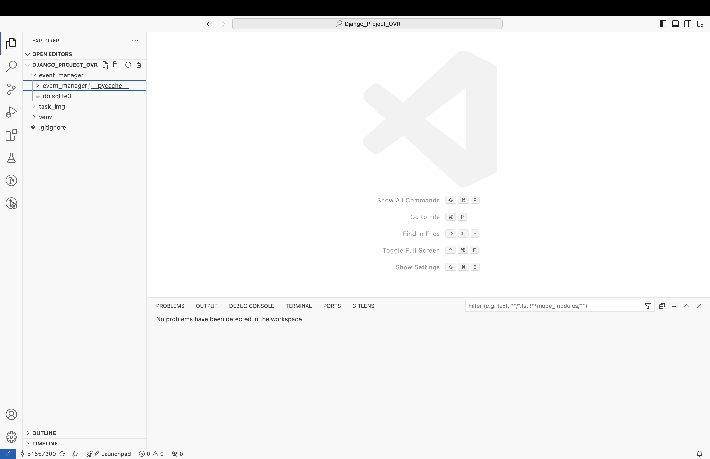
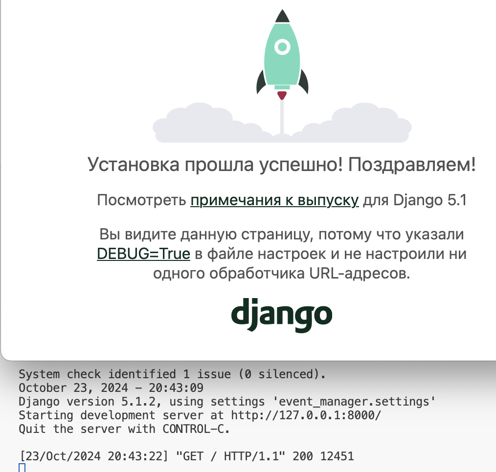

# Практическое занятие 17: Установка Django, создание проекта и настройка

**Цель занятия:**  
Создание и настройка проекта Django для системы управления мероприятиями, включая установку необходимых инструментов, создание виртуального окружения, инициализацию Git репозитория и выполнение первого коммита.

---

## Задачи занятия

1. **Установка Python и Git**
2. **Установка и настройка среды разработки Visual Studio Code (VSCode)**
3. **Создание и активация виртуального окружения**
4. **Установка Django**
5. **Создание нового проекта Django**
6. **Изучение структуры проекта**
7. **Настройка основных параметров проекта**
8. **Применение миграций**
9. **Запуск сервера разработки**
10. **Настройка системы контроля версий (Git)**
11. **Первый коммит и публикация в удалённый репозиторий GitHub**

---

## Задача 1: Установка Python и Git

### 1.1. Проверка установки Python

**На Windows:**
1. Откройте **Командную строку (Cmd)** или **PowerShell**:
   - Нажмите клавишу **Win**, введите `cmd` или `powershell` и нажмите **Enter**.
2. Введите команду:
   ```bash
   python --version
   ```
   или
   ```bash
   python3 --version
   ```

**На macOS/Linux:**
1. Откройте **Терминал**.
2. Введите команду:
   ```bash
   python3 --version
   ```

Если Python не установлен, скачайте и установите его с официального сайта: [https://www.python.org/downloads/](https://www.python.org/downloads/).

### 1.2. Проверка установки Git

**На Windows:**
1. Откройте **Командную строку (Cmd)** или **PowerShell**.
2. Введите команду:
   ```bash
   git --version
   ```

**На macOS/Linux:**
1. Откройте **Терминал**.
2. Введите команду:
   ```bash
   git --version
   ```

Если Git не установлен, скачайте и установите его с официального сайта: [https://git-scm.com/downloads](https://git-scm.com/downloads).

---

## Задача 2: Установка и настройка среды разработки Visual Studio Code (VSCode)

### 2.1. Скачивание и установка VSCode

1. Перейдите на официальный сайт VSCode: [https://code.visualstudio.com/](https://code.visualstudio.com/)
2. Скачайте установщик для вашей операционной системы.
3. Запустите установщик и следуйте инструкциям:
   - **Windows:** Рекомендуется поставить галочку "Add to PATH" для удобства использования из терминала.
   - **macOS/Linux:** Следуйте инструкциям на экране.


_Внешний вид Visual Studio Code_
### 2.2. Установка необходимых расширений

1. Откройте **VSCode**.
2. Перейдите в раздел **Extensions**:
   - **Русский:** Нажмите на иконку **Расширения** в боковой панели или используйте сочетание клавиш `Ctrl+Shift+X` (Windows) / `Cmd+Shift+X` (macOS).
   - **English:** Click on the **Extensions** icon in the sidebar or use the shortcut `Ctrl+Shift+X` (Windows) / `Cmd+Shift+X` (macOS).
3. Установите следующие расширения:
   - **Python** от Microsoft
   - **GitLens** (для улучшенной работы с Git)
   - **Django** (для поддержки синтаксиса Django)
   - **Pylance** (для улучшенной подсказки кода)

---

## Задача 3: Создание и активация виртуального окружения

Виртуальное окружение изолирует зависимости вашего проекта от других проектов и системных пакетов.

### 3.1. Создание папки для проекта

1. Откройте **VSCode**.
2. Нажмите на **File > Open Folder...**:
   - **Русский:** **Файл > Открыть папку...**
   - **English:** **File > Open Folder...**
3. Выберите директорию, где хотите создать проект, или создайте новую папку, например, `event_manager`.
   - *Можно на рабочем столе* 
4. Нажмите кнопку для открытия папки в VSCode.

### 3.2. Создание виртуального окружения

1. Откройте **Терминал** в VSCode:
   - **Русский:** Нажмите **Вид > Терминал** или используйте сочетание клавиш ``Ctrl+` ``
   - **English:** Click **View > Terminal** or use the shortcut ``Ctrl+` ``
2. В терминале убедитесь, что вы находитесь в корневой папке проекта (`event_manager`).
3. Введите команду для создания виртуального окружения:
   - **На Windows:**
     ```bash
     python -m venv venv
     ```
   - **На macOS/Linux:**
     ```bash
     python3 -m venv venv
     ```
4. После выполнения команды в папке проекта появится новая директория `venv`.

### 3.3. Активация виртуального окружения

1. В терминале введите команду для активации виртуального окружения:
   - **На Windows:**
     ```bash
     venv\Scripts\activate
     ```
   - **На macOS/Linux:**
     ```bash
     source venv/bin/activate
     ```
2. После активации вы увидите префикс `(venv)` перед строкой терминала, что означает, что виртуальное окружение активно.

### 3.4. Переходы между папками через терминал

Здесь вы можете ознакомиться с основными командами перемещения между папками в терминале. Выполнять их на данном шаге необязательно.
- **Просмотр содержимого текущей директории:**
  - **Русский:** Используйте команду `ls` (macOS/Linux) или `dir` (Windows).
    ```bash
    ls          # macOS/Linux
    dir         # Windows
    ```
- **Переход в другую директорию:**
  ```bash
  cd название_папки
  ```
- **Переход на уровень выше:**
  ```bash
  cd ..
  ```
- **Создание новой директории:**
  ```bash
  mkdir имя_папки
  ```
- **Переход в корневую директорию:**
  ```bash
  cd /
  ```

---

## Задача 4: Установка Django

### 4.1. Обновление pip (опционально)

Рекомендуется обновить менеджер пакетов `pip` до последней версии:
```bash
pip install --upgrade pip
```

*Примечание. В ходе тестирования на учебных компьютерах в РТУ МИРЭА обнаружилась ошибка верификации SSL-сертификатов (`SSLError`). В случае ошибки добавьте параметры командной строки:*

```bash
pip install --trusted-host pypi.org --trusted-host pypi.python.org --trusted-host files.pythonhosted.org --upgrade pip
```

### 4.2. Установка Django

В активированном виртуальном окружении выполните команду:
```bash
pip install django
```
В случае ошибки с SSL-сертификатами (добавляйте данные параметры и в дальнейшем при установке пакетов или модулей):

```bash
pip install --trusted-host pypi.org --trusted-host pypi.python.org --trusted-host files.pythonhosted.org django
```

### 4.3. Проверка установки Django

Убедитесь, что Django установлен корректно, выполнив команду:
```bash
django-admin --version
```
Вы должны увидеть установленную версию Django, например `4.2.5`.

---

## Задача 5: Создание нового проекта Django

### 5.1. Создание проекта

В терминале, находясь в директории `event_manager`, выполните команду:
```bash
django-admin startproject event_manager .
```
> **Примечание:** Точка `.` в конце команды указывает на создание проекта в текущей директории.

### 5.2. Структура проекта

После выполнения команды ваша структура проекта будет выглядеть следующим образом:
```
ваш_репозиторий/
├── manage.py
├── event_manager/
│   ├── __init__.py
│   ├── settings.py
│   ├── urls.py
│   ├── asgi.py
│   └── wsgi.py
└── venv/
```

---

## Задача 6: Изучение структуры проекта

- **`manage.py`**: утилита командной строки для взаимодействия с проектом.
- **`event_manager/`**: пакет с настройками и конфигурацией проекта.
  - **`__init__.py`**: обозначает директорию как пакет Python.
  - **`settings.py`**: конфигурация проекта.
  - **`urls.py`**: маршрутизация URL-адресов.
  - **`asgi.py`** и **`wsgi.py`**: настройки для развертывания приложения.

---

## Задача 7: Настройка проекта

### 7.1. Открытие файла `settings.py`

1. В **VSCode** откройте файл `event_manager/settings.py`.
2. Найдите и измените следующие параметры:

```python
LANGUAGE_CODE = 'ru-ru'

TIME_ZONE = 'Europe/Moscow'
```

### 7.2. Настройка статических и медиа файлов

В конце файла `settings.py` добавьте следующие настройки:

```python
STATIC_URL = '/static/'
STATICFILES_DIRS = [BASE_DIR / 'static']

MEDIA_URL = '/media/'
MEDIA_ROOT = BASE_DIR / 'media'
```

---

## Задача 8: Применение миграций

Создайте необходимые таблицы в базе данных, выполнив команду:

```bash
python manage.py makemigrations

python manage.py migrate
```

> **Описание:** Эти команды применят все миграции, создавая необходимые таблицы в базе данных SQLite по умолчанию.

---

## Задача 9: Запуск сервера разработки

### 9.1. Запуск сервера

В терминале выполните команду:

```bash
python manage.py runserver
```

> **Примечание:** Если вы используете macOS/Linux и команда `python` не работает, попробуйте `python3`.

### 9.2. Проверка работы сервера

1. Откройте браузер.
2. Перейдите по адресу: [http://127.0.0.1:8000/](http://127.0.0.1:8000/)
3. Вы должны увидеть приветственную страницу Django: "The install worked successfully! Congratulations!"


_Успешный запуск сервера Django_
### 9.3. Остановка сервера разработки

Чтобы остановить работающий сервер Django, выполните следующие действия:

**Через терминал:**
1. Перейдите в терминал, где запущен сервер (например, встроенный терминал VSCode).
2. Нажмите сочетание клавиш Ctrl + C (Windows) или Cmd + C (macOS/Linux).
- **Описание:** Это прерывает выполнение текущей команды и останавливает сервер разработки Django.

**Через меню IDE (Visual Studio Code):**
1. В терминале VSCode вы можете использовать кнопку **Trash** (иконка с мусорным ведром) для прерывания запущенной команды.
2. Перейдите в меню **Terminal > Kill Terminal**:
- **Русский:** Перейдите в меню **Терминал > Завершить терминал**.
- **English:** Go to **Terminal > Kill Terminal**.
3. Это также остановит выполнение сервера Django.

---

## Задача 10: Настройка системы контроля версий (Git)
### 10.1. Сделайте ветку для выполнения первого задания 

1. В **Системе управления версиями** откройте вкладку Branches и создайте ветку с названием **task_1** (правой кнопкой мыши по ветке **main - Create Branch...**)

_Создание ветки в VSC_

2. **После ввода названия выберите Create & Switch to Branch для переключения в ветку.**

_Создание и переключение на ветку в VSC_

**Убедитесь, что ветка переключилась - напротив task_1 должна стоять галочка ✔**

_Активная ветка task_1_
### 10.2. Сделайте первый коммит

**Добавлять коммиты можно и через интерфейс VSCode.**
Для правильного добавления нужно ввести сообщение коммита, нажать на **кнопку** Commit. В случае предупреждения рекомендуется согласиться на добавление всех файлов в индекс Git.


_Коммит в VSCode_

**Другой способ: через консоль**
*Это не нужно делать, если вы сделали коммит с помощью интерфейса VSC.*
1. Добавьте все файлы в индекс Git (**выполнять нужно из корневой папки**):

```bash
git add .
```

2. Выполните коммит с сообщением:

```bash
git commit -m "Инит: настройка проекта Django Event Manager"
```

> **Описание:** Этот коммит сохраняет текущую версию проекта в истории Git.

---

## Задача 11: Первый коммит и публикация в удалённый репозиторий

### 11.1. Отправка коммитов в удалённый репозиторий


_Отправка в VSCode_

В первую очередь, ветку нужно опубликовать. В интерфейсе появится кнопка **Опубликовать**. Для отправки изменений вы можете после публикации нажать на ту же кнопку (ее статус поменяется на синхронизацию изменений), или выбрать в дополнительном меню **Отправку**.

**Другой способ: через консоль**
*Это не нужно делать, если вы сделали коммит с помощью интерфейса VSC.*
Выполните команду:

```bash
git push -u origin main
```

> **Описание:** Эта команда отправляет ваш локальный коммит в удалённый репозиторий и устанавливает связь между локальной веткой `main` и удалённой веткой `main`.

### 11.2. Проверка репозитория

1. Перейдите на страницу вашего репозитория.
2. Убедитесь, что все файлы вашего проекта загружены корректно.

---

## Дополнительное задание

Для тех студентов, кто завершил основную часть раньше, предлагается выполнить следующие задания:

### 1. Исследование настроек проекта

- **Изучите файлы проекта:**
  - Откройте и ознакомьтесь с файлами `settings.py`, `urls.py` и `wsgi.py`.
- **Изменение параметра `DEBUG`:**
  - В `settings.py` измените значение `DEBUG` на `False` и попробуйте запустить сервер.
  - Обратите внимание на изменения в поведении приложения, такие как отключение детальных ошибок.

### 2. Установка дополнительных пакетов

- **Установка `django-environ`:**
  ```bash
  pip install django-environ
  ```
- **Настройка использования переменных окружения:**
  1. Создайте файл `.env` в корневой директории проекта и добавьте переменные, например:
     ```
     DEBUG=True
     SECRET_KEY=your-secret-key
     ALLOWED_HOSTS=127.0.0.1,localhost
     ```
  2. В `settings.py` импортируйте и используйте `django-environ` для загрузки переменных:
     ```python
      import os
      import environ

      # Инициализируем объект Env
      env = environ.Env(
          DEBUG=(bool, False)  # Указываем тип переменной DEBUG и значение по умолчанию
      )

      # Определяем путь к корневой директории проекта
      BASE_DIR = os.path.dirname(os.path.dirname(os.path.abspath(__file__)))

      # Читаем переменные из .env файла
      environ.Env.read_env(os.path.join(BASE_DIR, '.env'))

      # Применяем переменные из .env
      DEBUG = env('DEBUG')
      SECRET_KEY = env('SECRET_KEY')
     ```

### 3. Работа с Git

- **Создание новой ветки:**
  ```bash
  git checkout -b feature/setup-templates
  ```
- **Внесение изменений и коммит:**
  - Добавьте новые шаблоны или измените существующие.
  ```bash
  git add .
  git commit -m "Add base template and update navigation"
  ```
- **Слияние ветки с основной веткой:**
  ```bash
  git checkout main
  git merge feature/setup-templates
  git push origin main
  ```

### 4. Дополнительная работа с удаленным репозиторием

- **Создание README.md:**
  - Создайте файл `README.md` в корневой директории проекта и добавьте описание проекта, инструкции по установке и запуску.
- **Использование Issues и Pull Requests:**
  - Создайте Issue для новой функциональности или исправления ошибки.
  - Создайте Pull Request для внесённых изменений.

---

## Советы и рекомендации

- **Регулярно коммитьте изменения:**
  - Делайте коммиты после каждого значимого изменения в проекте.
- **Используйте ветвление в Git:**
  - Для разработки новых функций используйте отдельные ветки, чтобы избежать конфликтов в основной ветке.
- **Следите за безопасностью:**
  - Никогда не публикуйте секретные ключи и пароли в публичных репозиториях.
- **Документируйте проект:**
  - Ведите README-файл с описанием проекта, его установкой и использованием.

---

## Ресурсы

- [Документация Django](https://docs.djangoproject.com/en/4.2/)
- [Документация Git](https://git-scm.com/doc)
- [Документация GitHub](https://docs.github.com/)
- [Django Templates](https://docs.djangoproject.com/en/4.2/topics/templates/)
- [Django Static Files](https://docs.djangoproject.com/en/4.2/howto/static-files/)

---

## Заключение

Поздравляем! Вы успешно:
- Установили Python и Django.
- Создали и активировали виртуальное окружение.
- Создали новый проект Django для системы управления мероприятиями.
- Настроили основные параметры проекта.
- Запустили сервер разработки и проверили работу приложения.
- Настроили систему контроля версий для вашего проекта.
- Опубликовали проект в удалённый репозиторий на GitHub.

Вы готовы к дальнейшему изучению и разработке на Django. В следующем практическом занятии мы будем создавать первое приложение и знакомиться с базовой структурой сайта на Django.

Если у вас остались вопросы, не стесняйтесь задавать их.

Успехов в разработке!

---

## Дополнительные советы

- **Установка дополнительных пакетов:**  
  Устанавливайте необходимые пакеты внутри активированного виртуального окружения:
  ```bash
  pip install имя_пакета
  ```

- **Обновление `requirements.txt`:**  
  Чтобы сохранить список установленных пакетов:
  ```bash
  pip freeze > requirements.txt
  ```

- **Установка пакетов из `requirements.txt`:**  
  На другом компьютере или после клонирования репозитория:
  ```bash
  pip install -r requirements.txt
  ```

---

## Вопросы для обсуждения

Если у вас возникли вопросы или трудности на каком-либо этапе:
- Проверьте ошибки в терминале; они часто содержат полезную информацию.
- Убедитесь, что вы активировали виртуальное окружение перед установкой пакетов или запуском сервера.
- Обратитесь к документации Django: [https://docs.djangoproject.com/](https://docs.djangoproject.com/)
- Задайте вопрос преподавателю или обсудите с одногруппниками.

---

## Пример кода и команд

- **Создание виртуального окружения и установка Django:**
  ```bash
  python -m venv venv
  venv\Scripts\activate       # Windows
  source venv/bin/activate    # macOS/Linux
  pip install django
  ```

- **Создание проекта:**
  ```bash
  django-admin startproject event_manager .
  ```

- **Запуск сервера разработки:**
  ```bash
  python manage.py runserver
  ```

- **Настройка `settings.py`:**
  ```python
  # event_manager/settings.py

  LANGUAGE_CODE = 'ru-ru'
  TIME_ZONE = 'Europe/Moscow'

  STATIC_URL = '/static/'
  STATICFILES_DIRS = [BASE_DIR / 'static']

  MEDIA_URL = '/media/'
  MEDIA_ROOT = BASE_DIR / 'media'
  ```

---

## Готово!

Теперь ваш проект настроен, и вы можете перейти к созданию приложений и разработке функциональности. В следующем практическом занятии мы будем создавать первое приложение и знакомиться с базовой структурой сайта на Django.

Если у вас остались вопросы, не стесняйтесь задавать их.

Успехов в разработке!