# Инструкция по автоматизированному созданию рабочего пространства для выполнения практических работ по Django по курсу Основы-веб разработки

## Введение

Эта инструкция позволяет автоматизировано настроить рабочее пространство для разработки на Python, Django и сопутствующих библиотеках и учитывает особенности работы с компьютерами в классах РТУ МИРЭА.

## Шаг 1. Регистрация в GitFlic

GitFlic - российский сервис для хранения исходного кода.

1. Зарегистрируйтесь или авторизируйтесь на [GitFlic](https://gitflic.ru/).

2. В случае регистрации с помощью VK ID или Яндекс ID [создайте пароль на странице настройки пароля GitFlic](https://gitflic.ru/settings/password)

3. Создайте форк репозитория-шаблона: [seermakov355/Django_Project_OVR_Template: Шаблон для проекта по Django для студентов РТУ МИРЭА](https://gitflic.ru/project/seermakov355/django_project_ovr_template)

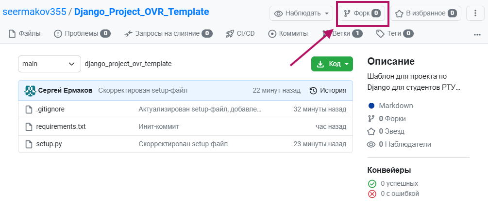

4. Заполните форму на странице первичной настройки форка 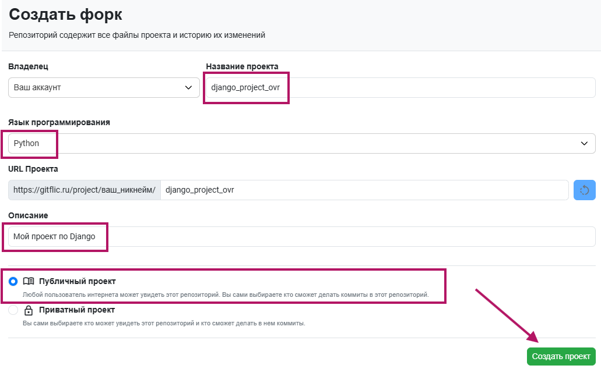
*Ура, первый этап пройден! Форк создан.*

## Шаг 2. Клонирование форка в VSC

6. Скопируйте ссылку на ваш форк из адресной строки (в формате https://gitflic.ru/project/ваш_никнейм/django_project_ovr)

7. Откройте IDE Visual Studio Code (VSC).

9. Откройте **Систему управления версиями (Source Control)**, и нажмите кнопку **Клонировать репозиторий**. 

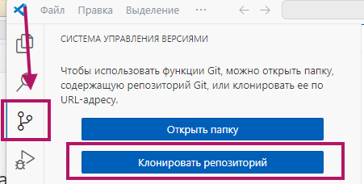

11. В появившемся окошке введите ссылку на ваш репозиторий **с .git в конце** (https://gitflic.ru/project/ваш_никнейм/django_project_ovr.git)

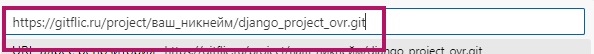

13. Выберите папку, в которой создастся каталог вашего форка. Можно рабочий стол.

14. Откройте репозиторий в VSC.

## Шаг 3. Установка

1. Откройте терминал: **Вид - Терминал**.

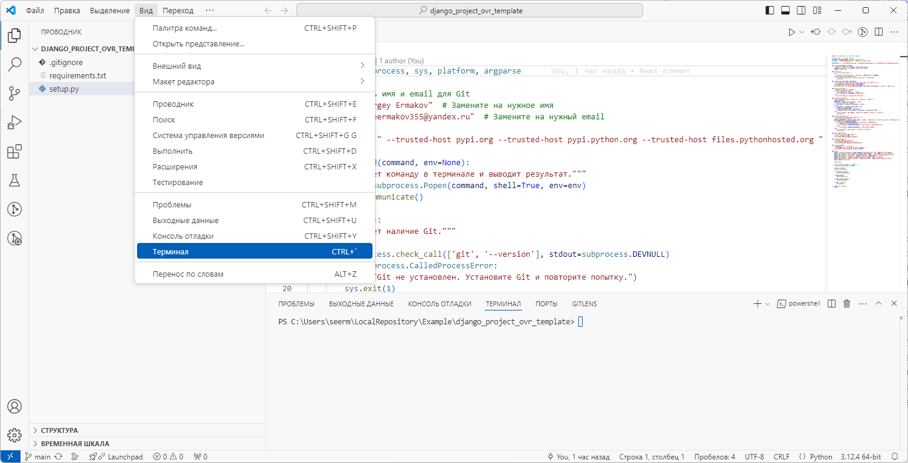

3. В файле **setup.py** введите ваши имя и почту для локальной настройки Git.

4. Проверьте в терминале глобальную установку Python, введя команду `python --version` (или `python3 --version`). Если Python установлен и запускается, терминал выведет актуальную версию интерпретатора.

5. Запустите скрипт для установки рабочей среды: `python setup.py` (или `python3 setup.py`). В случае успешной установки скрипт зарегистрирует вас в локальном Git, установит зависимости и Django.

## Шаг 4. Установка дополнительных расширений для VSC

Установите GitLens для более удобной работы с GIt - перейдите на **вкладку расширений** в VSC, введите **GitLens** и нажмите **Установить**.

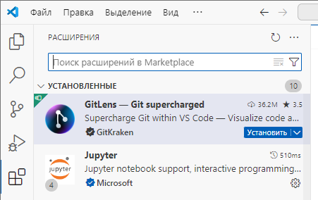

**После выполнения шагов этой инструкции необходимо перейти к задаче 5 первого практического задания по Django.**

В случае возникновения ошибок обращайтесь к преподавателю.

# Установка темы и изменение языка интерфейса в VSC

При желании, вы можете поменять тему IDE Visual Studio Code (с темной на светлую или наоборот) и/или язык.

## Установка темы

1. **Откройте палитру команд (Command Palette):**
   - Нажмите сочетание клавиш `Ctrl + Shift + P` (Windows/Linux) или `Cmd + Shift + P` (macOS).

2. **Введите `Color Theme` (Цветовая тема) и выберите `Preferences: Color Theme` (Параметры: Цветовая тема) из выпадающего списка.**
	- Если вы хотите сразу просто переключить цветовую тему - можно выбрать параметр **Переключение между светлой и темной темами**

4. **Выберите желаемую тему из списка:**
   - Используйте стрелки вверх/вниз для навигации.
   - Нажмите `Enter` для подтверждения выбора.

## Изменение языка интерфейса

1. **Откройте Visual Studio Code.**

2. **Откройте палитру команд (Command Palette):**
   - Нажмите сочетание клавиш `Ctrl + Shift + P` (Windows/Linux) или `Cmd + Shift + P` (macOS).

3. **Введите `Configure Display Language` (Настройка язык интерфейса) и выберите эту опцию из списка.**

4. **Выберите нужный язык из списка:**
   - Если нужный язык отсутствует, VS Code предложит установить соответствующий языковой пакет.

5. **Перезапустите Visual Studio Code для применения изменений.**

#### Установка языкового пакета (если необходимо)

1. **Откройте раздел расширений (Extensions):**
   - Нажмите на иконку **Extensions (Расширения)** в боковой панели или используйте сочетание клавиш `Ctrl + Shift + X` (Windows/Linux) / `Cmd + Shift + X` (macOS).

2. **В строке поиска введите название языкового пакета, например, `Russian Language Pack` (Русский Language Pack).**

3. **Найдите нужный пакет и нажмите кнопку `Install` (Установить).**

4. **После установки повторите шаги по изменению языка интерфейса.**

   
   _Установка языкового пакета_

#### Дополнительные советы

- **Установка дополнительных тем:**
  - В разделе расширений (**Extensions (Расширения)**) можно найти и установить различные темы оформления, например, `Dracula Official`, `One Dark Pro` и другие.

- **Смена темы через меню настроек:**
  - Перейдите в меню **File (Файл) > Preferences (Параметры) > Color Theme** (на Windows/Linux) или **Code (Code) > Preferences (Параметры) > Color Theme** (на macOS) и выберите тему из списка.

#### Примечания

- **Скачивание дополнительных тем:**
  - Вы можете искать темы по популярности, рейтингу или дате обновления в разделе расширений.

- **Предварительный просмотр тем:**
  - При выборе темы вы можете сразу увидеть, как она будет выглядеть, прежде чем подтвердить выбор.

- **Создание собственной темы:**
  - Если стандартные темы вам не подходят, вы можете создать свою собственную или настроить существующие через файлы настроек.

Следуя этим шагам, вы сможете настроить внешний вид и язык интерфейса Visual Studio Code в соответствии с вашими предпочтениями, что сделает процесс разработки более комфортным и продуктивным.

---

Если у вас возникнут дополнительные вопросы или потребуется помощь с настройкой VS Code, не стесняйтесь обращаться!

# Использование git и gitflic на уровне разработчика
## Первоначальная настройка
### Настройка git config

Для начала работы необходимо настроить имя пользователя и email в конфигурации git используйте следующие команды в терминале:
```bash
git config --global user.name "Ваше имя пользователя"
git config --global user.email "Ваш email"
```
Введенные тут данные никак не влияют на работу гита и будут только отображаться в коммитах.

### Генерация ssh ключа

Для подключения к удаленному репозиторию будет использоваться ssh ключ. Для его создания выполните в терминале следующую команду:
```bash
ssh-keygen -t rsa
```
Все остальные поля ввода оставьте пустыми

## Создание локального репозитория
1. Откройте корневую папку проекта через vscode, в боковом меню откройте третью вкладку слева, нажмите на кнопку `Initialize Repository`

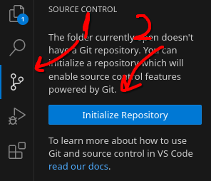

2. Добавьте (stage) изменения, введите название коммита и нажмите на кнопку `Commit`

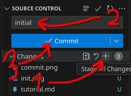

## Создание проекта на gitflic и выкладывание исходного кода

### Авторизация на gitflic
Перейдите на [gitflic](https://gitflic.ru/) и нажмите регистрация в правом верхнем углу экрана. Тут можно создать новый аккаунт или использовать для авторизации ВК или Яндекс. Рекомендуется использовать аккаунт ВК или Яндекс, чтобы упростить регистрацию и не потерять доступ к репозиторию.

### Добавление ssh ключа
Далее необходимо добавить ssh ключ, созданный при [первоначальной настройке](#генерация-ssh-ключа). Чтобы его получить выполните в терминале команду 
```bash
cat ~/.ssh/id_rsa.pub
```
В giflic: 
1. Нажмите на свое имя пользователя в левом верхнем углу;
2. Нажмите на кнопку `Редактировать` в правом верхнем углу;
3. Выберите пункт `ключи` в правом меню;
4. Скопируйте ключ из консоли и вставьте его в большое поле ввода по центру экрана, дайти ключу название и выберете дату окончания;
5. Нажмите на кнопку `добавить`;

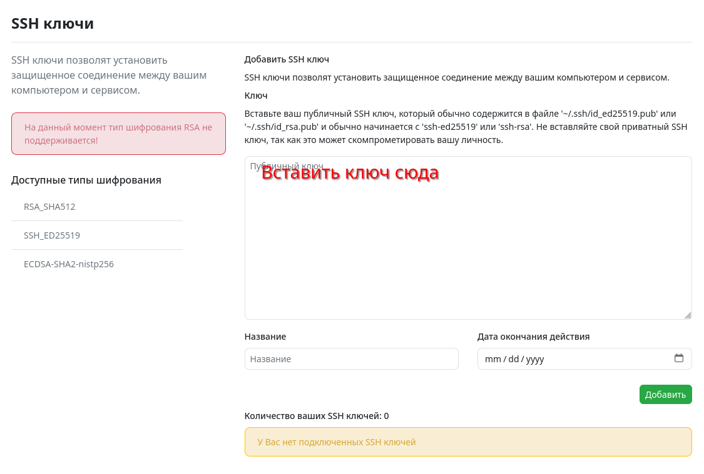

### Создание проекта
В gitflic:
1. В левом меню откройте вкладку проекты;
2. Нажмите на кнопку `Создать проект` в правом верхнем углу;
3. Введите название проекта (рекомендуется использовать английские символы);
4. Нажмите на кнопку `Создать проект` в правом нижнем углу;

### Загрузка локального репозитория
В gitflic перейдите на странцу проекта (вы должны быть на ней, если выполняли [предыдущий шаг](#создание-проекта)), выберете тип ссылки `ssh` и скопируйте ее.

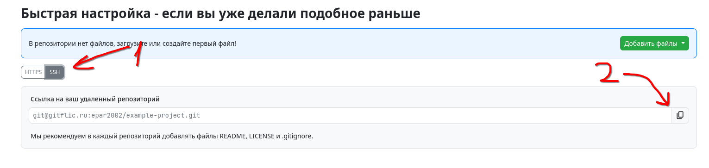

В vscode в контекcтном меню выберите `Remote -> Add Remote` и в появившееся поле ввода вставьте ссылку на репозиторий, нажмите enter. После чего введите название удаленного источника (обычно пишут `origin`) и снова нажмите enter.

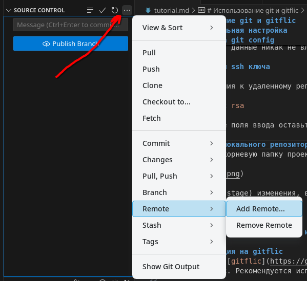


После чего нажмите кнопку `push branch`.

## Редактирование данных
После внесения изменений их необходимо сохранить в локальном репозитории и выгрузить в удаленное хранилище.
### Создание коммита
Для создания коммита необходимо сохранить изменения, дать коммиту название и нажать на кнопку commit.


### Выгрузка изменений в удаленный репозиторий

Для выгрузки изменений в удаленный репозиторий нажмите кнопку `Sync changes`