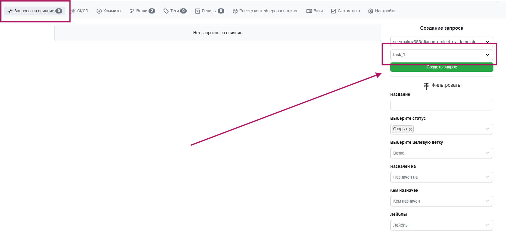
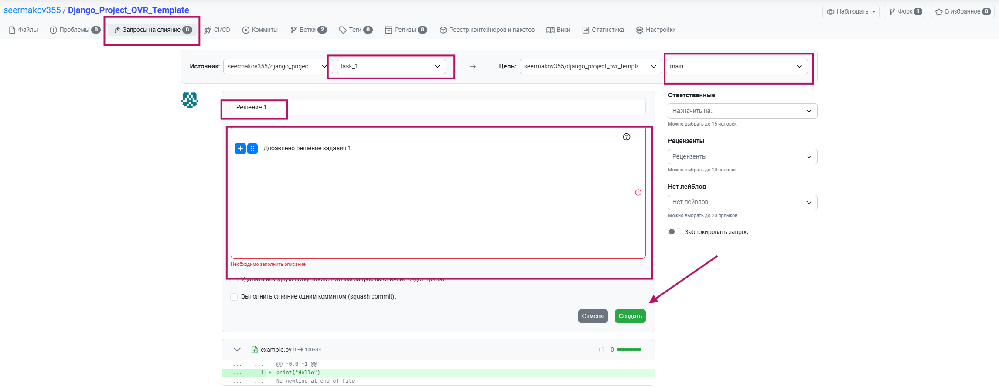
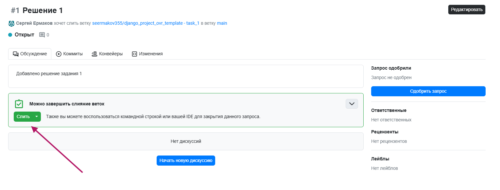
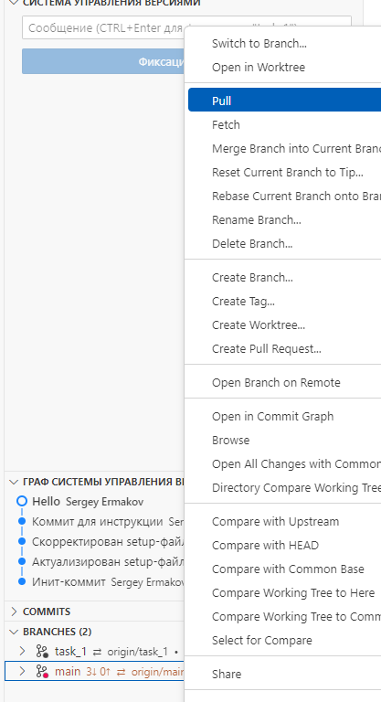
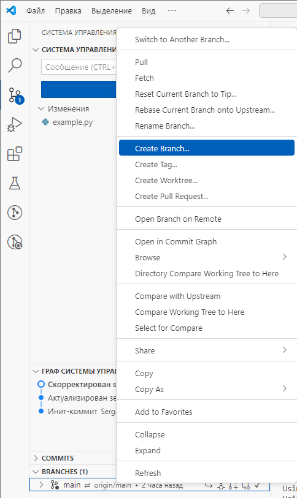
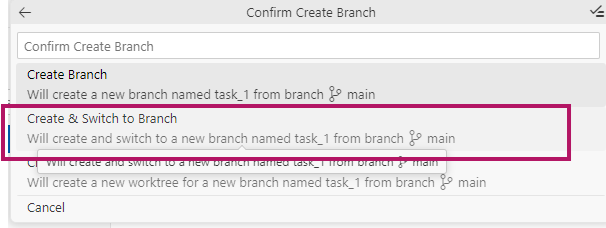
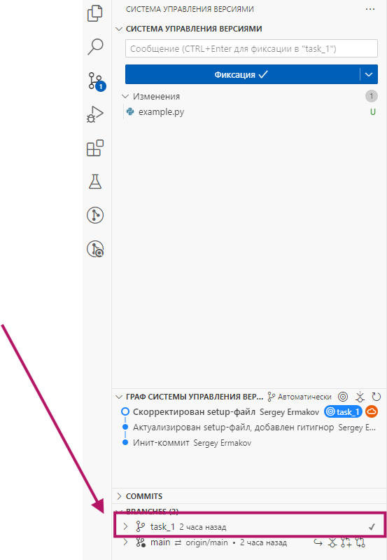
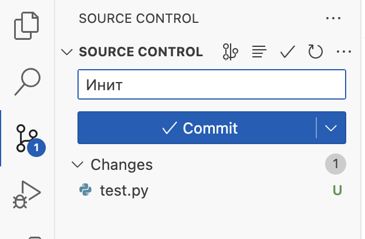
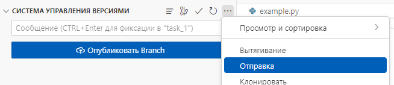

# Инструкция по сдаче заданий в СДО

В СДО по каждому заданию вам необходимо предоставить pull request - результат слияния веток для отдельных заданий в основную ветку.
## Как сделать pull request
1. В вашем репозитории на GitFlic откройте **Запросы на слияние**.
2. В меню справа **Создание запроса** выберите ветку с заданием (**task_n**) и нажмите кнопку.

3. Заполните поля запроса. **Обратите внимание: источником является ветка с выполнением задания, а целью - ветка main!**

4. Слейте ветку с main. 
6. Скопируйте ссылку на pull request (в формате https://gitflic.ru/project/ваш_репозиторий/django_project_ovr_template/merge-request/1) и отправьте в соответствующую форму в СДО.

**ВНИМАНИЕ!** Для продолжения работы после слияния вам нужно подождать несколько секунд и синхронизировать ветку main в Visual Studio Code.

7. Для синхронизации ветки выберите Pull в меню (нужно нажать на main правой кнопкой мыши)

8. После pull-реквеста вам нужно выбрать ветку main  (Switch to Branch) и создать новую ветку для продолжения процесса разработки.

## Напоминание: работа с ветками в VSC

В **Системе управления версиями** откройте вкладку Branches и создайте ветку с названием **task_1** (правой кнопкой мыши по ветке **main - Create Branch...**)

_Создание ветки в VSC_

2. **После ввода названия выберите Create & Switch to Branch для переключения в ветку.**

_Создание и переключение на ветку в VSC_

**Убедитесь, что ветка переключилась - напротив task_1 должна стоять галочка ✔**

_Активная ветка task_1_

### Добавление коммитов

**Добавлять коммиты можно и через интерфейс VSCode.**
Для правильного добавления нужно ввести сообщение коммита, нажать на **кнопку** Commit. В случае предупреждения рекомендуется согласиться на добавление всех файлов в индекс Git.


_Коммит в VSCode_

**Другой способ: через консоль**
*Это не нужно делать, если вы сделали коммит с помощью интерфейса VSC.*
1. Добавьте все файлы в индекс Git (**выполнять нужно из корневой папки**):

```bash
git add .
```

2. Выполните коммит с сообщением:

```bash
git commit -m "Инит: настройка проекта Django Event Manager"
```

> **Описание:** Этот коммит сохраняет текущую версию проекта в истории Git.

### Первый коммит и публикация в удалённый репозиторий



_Отправка в VSCode_

В первую очередь, ветку нужно опубликовать. В интерфейсе появится кнопка **Опубликовать**. Для отправки изменений вы можете после публикации нажать на ту же кнопку (ее статус поменяется на синхронизацию изменений), или выбрать в дополнительном меню **Отправку**.

**ВНИМАНИЕ! Если вы еще не заходили в текущей сессии с помощью своих логина и пароля от GitFlic, это нужно будет сделать в окне ввода учетных данных (появляется автоматически)**

**Другой способ: через консоль**
*Это не нужно делать, если вы сделали коммит с помощью интерфейса VSC.*
Выполните команду:

```bash
git push -u origin main
```

> **Описание:** Эта команда отправляет ваш локальный коммит в удалённый репозиторий и устанавливает связь между локальной веткой `main` и удалённой веткой `main`.

### Проверка репозитория

1. Перейдите на страницу вашего репозитория.
2. Убедитесь, что все файлы вашего проекта загружены корректно.